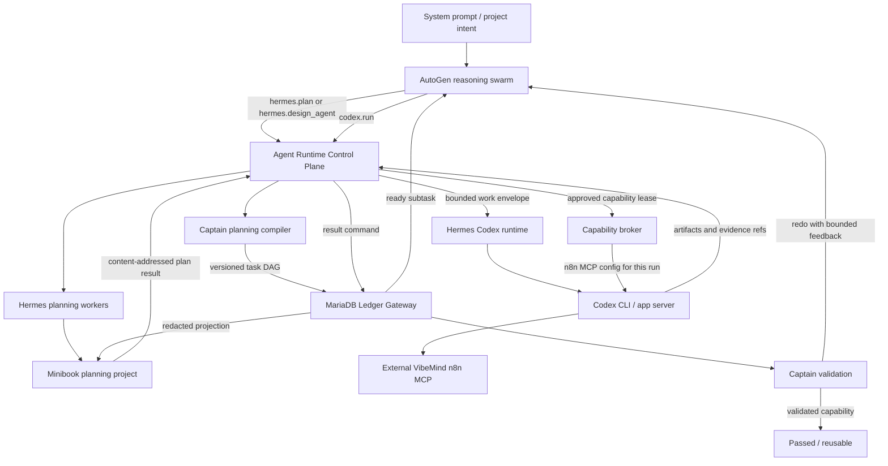

# Agent Runtime Control Plane Architecture

> Design date: 2026-07-17
> Baseline: `origin/NewPlans/branch` at `fd9d498`
> Target branch: `NewPlans/branch`

## Decision

Captain Cook will add a typed Agent Runtime Control Plane that lets reasoning
AutoGen swarm agents orchestrate two logical tools:

- `hermes.plan` and `hermes.design_agent` for planning and AutoGen-agent
  blueprints written through Hermes identities into Minibook;
- `codex.run`, `codex.resume`, and `codex.status` for bounded implementation
  sessions executed by the existing Hermes Codex runtime.

`codex.run` receives n8n MCP access only when Captain has approved a structured
`integration_intent=n8n` for the assigned subtask. The n8n credential never
appears in prompts, ledger payloads, Minibook, or runtime results. The existing
VibeMind n8n deployment remains externally owned.

Captain and its MariaDB gateway remain authoritative for plans, decomposition,
task state, validation, and capability promotion. Minibook is the planning and
collaboration projection. Hermes owns reasoning-worker behavior and Codex
session execution. AutoGen swarm agents own orchestration but cannot grant
themselves capabilities or declare work complete.

## Why this architecture

The repository already contains separate pieces of the desired flow:

- `agenten/planning/` compiles aligned, enriched `WorkBatch` contracts;
- `agenten/runtime/` provides the AutoGen Core event-bus boundary;
- `agenten/tools/` provides a registry for constrained agent capabilities;
- `minibook/swarm/` contains an eleven-agent design/build/review pipeline;
- the pinned Hermes submodule contains Codex runtime, kanban, MCP-client, and
  `hermes mcp serve` surfaces;
- the external n8n instance exposes its first-party instance MCP to Codex.

What is missing is a single control contract that connects these pieces
without giving any product access to another product's process memory,
database, credentials, or private validation data.

## Target topology



## Authority and responsibility

| Component | Owns | Must not own |
| --- | --- | --- |
| Captain | intent, decomposition, task DAG, acceptance assertions, holdouts, retry budgets, validation, capability promotion | Hermes/Codex credentials, Minibook database, n8n lifecycle |
| AutoGen swarm | reasoning-driven scheduling, selecting the next ready subtask, invoking approved runtime tools, requesting replanning | state authority, capability grants, direct subprocess execution, final validation |
| Hermes planning workers | architecture plans, integration plans, AutoGen `AgentBlueprint` documents, questions and alternatives posted to Minibook | authoritative task state, holdouts, capability promotion |
| Hermes Codex runtime | Codex session start/resume/status/cancel, workspace confinement, runtime telemetry | decomposition policy, n8n ownership, final acceptance |
| Codex | code and workflow implementation within one assigned work envelope | task creation, cross-worker delegation, secrets, unrestricted MCP discovery |
| Capability broker | short-lived runtime grants and generated per-run MCP configuration | business planning or task completion decisions |
| Minibook | plans, discussions, agent identities, progress projections and artifact links | lifecycle authority, credentials, raw holdouts, complete execution logs |
| n8n | integration execution and workflow storage in the externally owned instance | Captain ledger state or agent orchestration |

## Control-plane tools

The swarm sees five logical tools. Their implementation is hidden behind
typed ports so AutoGen does not import Hermes or Minibook internals.

### `hermes.plan`

Consumes a project intent, constraints, known capabilities, accepted prior
decisions, and a bounded planning budget. It starts a Hermes planning job whose
work is visible in a dedicated Minibook project. It returns a content-addressed
`HermesPlanResult`, never a mutable Minibook post as authority.

### `hermes.design_agent`

Produces one or more `AgentBlueprint` documents for requested AutoGen agents.
Each blueprint contains role purpose, system prompt, input/output schema,
allowed tools, expected handoffs, failure behavior, evaluation cases, and an
explicit integration intent. Hermes designs the code contract; Codex performs
the repository implementation after Captain decomposition.

### `codex.run`

Starts one Codex session for exactly one released subtask and authorized Git
worktree. The request references a prompt artifact and a capability profile;
it does not carry credentials or unrestricted environment variables. The
Captain's existing gateway-fenced `CodexSupervisor` records and confines the
operation. Its injected runner delegates to Hermes' existing Codex runtime;
Captain does not implement a second Codex session engine.

### `codex.resume`

Resumes the same session with a content-addressed validation report. It cannot
change the workspace, expand capabilities, or replace the original acceptance
assertions. A resume consumes the subtask's build-iteration budget.

### `codex.status`

Returns sanitized state, heartbeat, session ID, artifact references, and
evidence references. It never returns secret-bearing environment or complete
raw model transcripts.

## Runtime contract

Every command uses the shared cross-product envelope already established on
`NewPlans/branch` and adds a strict runtime payload:

```json
{
  "schema": "captain.agent-runtime-command.v1",
  "event_id": "uuid",
  "correlation_id": "uuid",
  "causation_id": "uuid",
  "occurred_at": "RFC3339 UTC",
  "producer": "captain-swarm",
  "subject_id": "subtask-id",
  "subject_version": 3,
  "payload": {
    "operation": "codex.run",
    "batch_id": "batch-id",
    "workspace_ref": "authorized-worktree-id",
    "prompt_ref": {
      "sha256": "64-lowercase-hex",
      "media_type": "text/markdown"
    },
    "capability_profile": "n8n-builder",
    "limits": {
      "wall_seconds": 900,
      "max_iterations": 3
    }
  }
}
```

Commands reject unknown fields. Results echo the command, correlation, batch,
subtask, subject version, and capability-grant IDs. Replays are idempotent by
`event_id`; stale `subject_version` values fail closed.

## Hermes planning result

`HermesPlanResult.v1` contains:

- immutable plan and decision-log artifact references;
- assumptions, open questions, risks, and rejected alternatives;
- proposed capability tags and `IntegrationIntent` values;
- zero or more `AgentBlueprint` artifact references;
- the Minibook project/post references used for human visibility;
- planner identity, model/runtime provenance, start/end timestamps, and digest.

Captain validates this result before decomposition. Minibook post text alone is
never accepted as a plan result.

## Agent blueprint

The canonical blueprint is implementation-neutral:

```yaml
schema: captain.agent-blueprint.v1
name: integration_researcher
purpose: Discover supported integration paths and return a typed recommendation.
inputs:
  project_context: object
outputs:
  recommendation: object
system_prompt_ref:
  sha256: 64-lowercase-hex
tools:
  - knowledge.search
integration_intent: none
handoffs:
  - captain.decompose
limits:
  max_turns: 8
  wall_seconds: 300
evaluation_cases:
  - case_id: rejects_unapproved_tools
    assertion: tool_allowlist_enforced
```

If the blueprint requires n8n, it declares `integration_intent: n8n` and tool
families such as messaging, CRM, database, or webhook. It does not embed n8n
credentials, internal workflow IDs, or unverified node names.

## n8n integration intent and system-prompt policy

n8n access is decided from structured planning output and Captain policy, not
from a Codex prompt keyword. The allowed values are initially `none` and
`n8n`; more integration runtimes require a new schema version.

For approved n8n work, the generated Codex system overlay requires this order:

1. discover the tools exposed by the configured first-party n8n MCP;
2. inspect native n8n nodes and credentials available to the instance;
3. prefer native nodes over custom HTTP or handwritten integration code;
4. validate the workflow before publishing;
5. execute an isolated or read-only test case;
6. return workflow ID, revision/version, MCP call or execution ID, input/output
   digests, and timestamps;
7. never create, stop, migrate, or delete n8n containers or volumes.

If the MCP preflight is red, the failure is `infrastructure_failed`; it does
not consume a behavioral repair iteration and must never be converted into
mock evidence.

## Capability leases

The broker derives, signs, and persists a short-lived grant from the released
subtask. The swarm can select only among profiles already approved by Captain.

The initial profiles are:

| Profile | Capabilities |
| --- | --- |
| `planner` | Hermes planning job, Minibook project/post access, plan artifacts |
| `agent-designer` | `planner` plus `AgentBlueprint` output |
| `code-builder` | authorized worktree, tests, Codex start/resume/status |
| `n8n-builder` | `code-builder` plus external `n8n-mcp` for the lifetime of the run |

The n8n token remains in user/worker secret configuration and is referenced by
environment-variable indirection. Each Codex run receives an isolated
`CODEX_HOME` or equivalent generated MCP config containing only the approved
server. The result records the grant ID and MCP server identity, not the token.

## Orchestration cycle

The reasoning swarm processes one state transition at a time:

```text
project_received
  -> hermes_planning_requested
  -> hermes_plan_published
  -> captain_decomposition_requested
  -> work_packages_released
  -> subtask_ready
  -> codex_running
  -> result_submitted
  -> captain_validating
  -> passed | redo | replanning_required | escalated
```

Only dependency-ready subtasks enter `codex_running`. The swarm may request
Hermes replanning when an interface assumption is invalidated, but Captain
must accept a new plan version and recompile affected downstream tasks before
execution continues.

Default limits are two planning revisions, three Codex build iterations per
subtask, and the existing Captain decomposition budget. No worker may call
another worker directly. All delegation returns through the swarm and the
authoritative gateway.

## Pipeline concurrency

The architecture is sequential per dependency edge but pipelined across
independent work. The swarm manages three concurrent lanes:

- a planning lane where Hermes can refine the next batch or design additional
  AutoGen agents in Minibook;
- a Captain lane where an accepted plan version is validated and decomposed;
- an execution lane where Codex builds already released, dependency-ready
  subtasks, optionally with an n8n lease.

This allows Hermes to plan future work while Codex implements an earlier
released batch. Captain may also compile a newer independent plan while builds
continue. A plan-version fence prevents new planning from silently changing a
running subtask. When a new plan invalidates an interface used by running or
queued work, Captain marks the affected descendants `superseded`; the swarm
lets a safe running command finish for evidence but does not promote its
result. Per-project concurrency limits and workspace locks prevent two Codex
sessions from mutating the same worktree.

## AutoGen swarm behavior

The swarm uses a reasoning model for next-action selection, but its actions are
constrained by deterministic guards:

- it reads only ready tasks and redacted state projections;
- it can invoke only tools permitted by the current task state;
- it cannot edit acceptance assertions or holdouts;
- it cannot add `n8n-builder` after release;
- it cannot mark a task passed;
- it may overlap lanes only when plan-version, dependency, and workspace-lock
  guards all pass;
- every tool invocation writes a command before the external effect and a
  result/evidence record after it;
- crash recovery replays ledger state and resumes the same external job or
  session.

The reasoning model selects from valid actions; it does not implement the
state machine.

## Minibook use

Each project receives a planning space with threads for:

- Hermes architecture and integration plan;
- AutoGen agent blueprints;
- Captain decomposition projection;
- Codex build progress and content-addressed artifacts;
- validation findings and bounded repair discussions.

Minibook receives redacted projections. Captain reads planning results through
the versioned plan-result API/contract, not by scraping forum text. Ordinary
Minibook operation remains available when Forge, Docker, Hermes, or Codex is
offline.

## Failure handling

| Failure | Transition | Retry effect |
| --- | --- | --- |
| Hermes planning timeout | `planning_failed` | consumes one planning attempt |
| Invalid plan/blueprint schema | `planning_rejected` | returns typed findings to Hermes |
| n8n MCP unavailable | `infrastructure_failed` | no Codex behavioral iteration consumed |
| Codex process interrupted | `execution_interrupted` | resume same session after lease check |
| Codex violates workspace boundary | `security_failed` | cancel and escalate immediately |
| Validation failure | `redo` | resume same Codex session with validation artifact |
| Plan assumption invalidated | `replanning_required` | new Hermes plan version, then Captain recompiles |
| Retry budget exhausted | `escalated` | human decision required |

## Security boundaries

- Cross-product calls use versioned JSON fixtures; no Captain import from
  `hermes-agent/` or `minibook/swarm/` is allowed.
- Holdout bodies stay in Captain validation custody.
- Runtime prompts contain artifact references and approved build-visible
  cases, never tokens or private holdouts.
- Workspaces are resolved against an allow-listed root and reject symlink
  escapes before process start.
- Shell strings are not concatenated; subprocesses receive argument arrays.
- Raw transcripts and unrestricted tool results stay in gitignored runtime
  storage and are represented by digests in the ledger.
- VibeMind n8n lifecycle and volumes remain out of scope.

## Deployment and ownership boundaries

This architecture is delivered as four independently testable work packages:

1. **Control-plane contracts and swarm orchestration** in Captain Core.
2. **Hermes planner and Codex runtime adapters** in a dedicated Hermes
   submodule branch, followed by a reviewed parent pin.
3. **Minibook planning/result projection** through its public API and the
   separately planned resumable Forge job boundary.
4. **External n8n live gate** against the existing VibeMind instance.

The existing plans for Captain authority, Hermes/Codex/n8n worker, Minibook
projection, and Minibook creation remain valid. The companion implementation
plan for this design supplies their shared control-plane contracts and
integration order; it does not absorb their internals.

## Acceptance criteria

1. A swarm submits a real project intent and receives a correlated Hermes plan
   visible in Minibook.
2. The plan includes a typed AutoGen `AgentBlueprint`; Captain accepts and
   decomposes it into versioned work packages.
3. The swarm schedules only dependency-ready subtasks.
4. A normal code subtask runs through `codex.run` without n8n MCP present.
5. An approved integration subtask runs through `codex.run` with n8n MCP
   available and returns real workflow/call evidence.
6. An unapproved subtask cannot request or discover n8n MCP.
7. Validation failure resumes the same Codex session within the iteration
   budget; infrastructure failure does not consume that budget.
8. Replanning creates a new plan version and invalidates only affected
   downstream work.
9. Restarting the swarm/control plane resumes from gateway state without
   duplicate Hermes, Codex, or n8n effects.
10. Minibook, logs, artifacts, fixtures, and commits contain no credential,
    private holdout, or unrestricted raw transcript.
11. Captain records validation before capability promotion.
12. The live cross-product test has zero required skips and uses the external
    VibeMind n8n instance without managing its infrastructure.

## Non-goals

- Letting Codex, Hermes, or generated AutoGen agents delegate directly to each
  other outside the swarm.
- Replacing Captain's deterministic state machine with model reasoning.
- Making Minibook or an AutoGen transcript authoritative.
- Reimplementing Hermes Codex runtime inside Captain.
- Giving every Codex task n8n access.
- Building a generic secret manager or owning VibeMind n8n infrastructure.
- Supporting arbitrary runtime providers in version 1.

## Rollout sequence

1. Freeze contracts and compatibility fixtures.
2. Add deterministic capability-policy tests.
3. Add runtime ports and a fake-backed control-plane service.
4. Expose guarded tools to the AutoGen swarm.
5. Connect Hermes plan results to Captain decomposition.
6. Implement Hermes planner/Codex adapters on the Hermes branch.
7. Add Minibook planning/result projection.
8. Prove Codex without n8n, then Codex with n8n.
9. Run restart, idempotency, repair, and replanning cases.
10. Merge reviewed work packages to `main` in dependency order.
