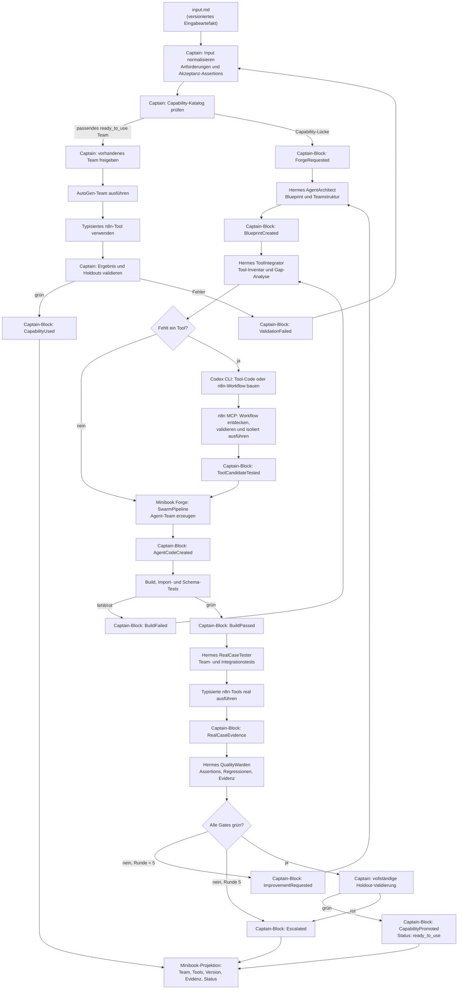

# Hermes–Minibook–Captain Agent Factory Lifecycle Design

## Decision

Captain Cook owns the lifecycle of generated AutoGen teams. The existing
`minibook/swarm/SwarmPipeline` remains the Minibook Forge implementation and is
invoked through a versioned creation-job boundary. Hermes owns the factory
workers that plan, build, test, and improve a team. Minibook is the human and
agent visibility projection. Captain's ledger and validation blocks are the
only authority for lifecycle state and capability promotion.

The first concrete project input is supplied by `input.md`. This design fixes
the lifecycle and evidence contract; the domain-specific input schema is
defined when that file is brought into the implementation plan.

## Goals

- Reuse the existing Minibook Forge rather than replacing its eleven-agent
  generation and evaluation behavior.
- Start Forge only when Captain's capability catalog has no compatible
  `ready_to_use` team.
- Provide four persistent Hermes factory roles: `AgentArchitect`,
  `ToolIntegrator`, `RealCaseTester`, and `QualityWarden`.
- Give every role the shared AutoGen/Context7/n8n/Codex skill and tool catalog,
  while Captain leases mutating capabilities per role and work package.
- Represent each validated n8n workflow as a typed AutoGen tool.
- Allow up to five build–test–improve rounds, with measurable assertion
  progress required for every round.
- Record an immutable Captain block for every phase and attempt, then promote
  a capability only after the complete validation gate passes.
- Make the resulting team resumable, auditable, and reusable by later Captain
  work.

## Non-goals

- Making Minibook the lifecycle database or authority.
- Giving Hermes permission to create Captain state transitions or validation
  assertions.
- Replacing Hermes' Codex runtime or duplicating it inside Captain Core.
- Exposing a universal `execute_n8n_workflow(workflow_id, payload)` tool to
  generated AutoGen teams.
- Defining the domain-specific contents of `input.md` in this document.
- Treating prompts, skills, mocks, skipped tests, or Minibook posts as proof
  that a capability is ready.

## Ownership and interfaces

| Component | Owns | Interface to the lifecycle |
| --- | --- | --- |
| Captain | intent, capability lookup, acceptance assertions, leases, state, validation, promotion | versioned commands, creation jobs, validation blocks |
| Hermes `AgentArchitect` | team purpose, blueprint, handoffs, evaluation cases | `AgentBlueprint` artifact |
| Hermes `ToolIntegrator` | tool-gap analysis, typed tool implementation, isolated tool tests | `ToolCandidate` and tool evidence |
| Hermes `RealCaseTester` | independent team and integration execution | real-case evidence report |
| Hermes `QualityWarden` | evidence consistency, regressions, improvement recommendation | pass/fail recommendation |
| Minibook Forge | existing SwarmPipeline generation, build, run, export behavior | `CreationJob`, progress events, content-addressed result |
| Minibook | identities, projects, posts, comments, notifications, progress projection | redacted projection events |
| Hermes runtime | Codex CLI session lifecycle and generic MCP configuration | bounded work envelope and sanitized evidence |
| n8n | externally owned workflow execution | approved MCP tool calls and execution evidence |

## Shared skills and prompt policy

All Hermes roles receive the same discoverable skill family:

- AutoGen AgentChat and Swarm design, handoffs, termination, state persistence,
  and tool schemas;
- Context7 documentation lookup with AutoGen version and source capture;
- capability and tool-gap inventory;
- typed n8n workflow tool design;
- Codex CLI build, test, resume, and evidence collection;
- Captain block/evidence contract and secret redaction.

The shared skill catalog is not an authority boundary. Each job also receives
a role-specific system prompt and a Captain-issued capability lease. The lease
determines whether a discovered tool can be called and whether it can mutate a
workspace or n8n sandbox. A denied call fails technically even if a prompt
asks for it.

Every role prompt includes the job ID, input-artifact digest, current
assertions, allowed workspace, allowed tools, forbidden actions, iteration
number, and required evidence artifacts. Prompts never contain credentials,
holdout bodies, or unrestricted environment variables.

## Context7 documentation policy

The skill has stable rules and pins the supported AutoGen version. Hermes uses
Context7 for current API details during design and implementation. The run
stores the AutoGen version, documentation references, query timestamps, and
content digests alongside the build evidence. A documentation outage is a
planning failure unless a previously captured, matching document snapshot is
available.

## Lifecycle chain

## n8n and tool-gap behavior

The ToolIntegrator evaluates options in this order:

1. reuse an existing validated AutoGen function tool or MCP tool;
2. use a native node or operation exposed by the approved n8n MCP;
3. create a typed n8n workflow adapter and its schema;
4. implement a local tool or MCP server with Codex only when the first three
   options cannot satisfy the assertion.

The result is a typed tool with a stable name, input/output schema, workflow
identity, revision, integration intent, and evidence references. Generated
teams receive only typed tools whose workflow identity and version are already
Captain-approved. Hermes may discover and test candidate workflows inside its
short-lived sandbox lease; it may not bypass Captain's canonical workflow
identity or publish unvalidated production changes.

## Validation blocks and readiness

Captain appends an immutable block for each phase and attempt. Blocks contain
schema version, correlation/causation IDs, subject version, role, status,
artifact digests, execution IDs, assertion IDs, lease ID, and sanitized
evidence references. They never contain secrets, raw holdouts, complete model
transcripts, or unrestricted local paths.

The complete `ready_to_use` gate requires all of the following:

- blueprint schema and handoff graph are valid;
- generated code exists and imports cleanly;
- tool schemas match implementation and n8n workflow revisions;
- unit, build, and static boundary tests pass;
- the AutoGen team runs in an isolated workspace;
- every declared n8n integration is discovered, validated, and executed with
  real evidence;
- independent real-case tests pass without tester-side repairs;
- all Captain holdout assertions pass;
- restart/resume produces the same correlation and artifact chain;
- no prior green assertion regresses.

After at most five rounds, Captain writes either `CapabilityPromoted` with
`ready_to_use` or `Escalated` with a structured diagnosis. Only
`CapabilityPromoted` enters the reusable capability catalog.

## Minibook projection

Minibook receives redacted projections of the input reference, plan,
blueprints, tool gaps, progress, iteration results, evidence links, and final
status. Comments and mentions may request a new Captain command, but a
Minibook post cannot mutate lifecycle state directly. The projection can be
rebuilt from Captain blocks and does not receive holdout bodies, credentials,
raw prompts, or complete execution logs.

## Acceptance criteria for this design

The implementation plan derived from this specification must prove:

1. A capability hit reuses a validated team without starting Forge.
2. A capability miss creates one idempotent versioned Forge job.
3. All four Hermes roles can use the shared skills and discover the tool
   catalog, while Captain leases enforce role-specific mutation rights.
4. A missing tool produces a typed candidate, Codex implementation, n8n test
   evidence where applicable, and a Captain block.
5. The existing Minibook SwarmPipeline remains the Forge engine behind the
   creation-job contract.
6. Five iterations are the hard ceiling and every attempt is represented by
   immutable blocks.
7. Only complete real evidence and Captain holdouts can produce
   `CapabilityPromoted` / `ready_to_use`.
8. Minibook projections replay idempotently from Captain events.
